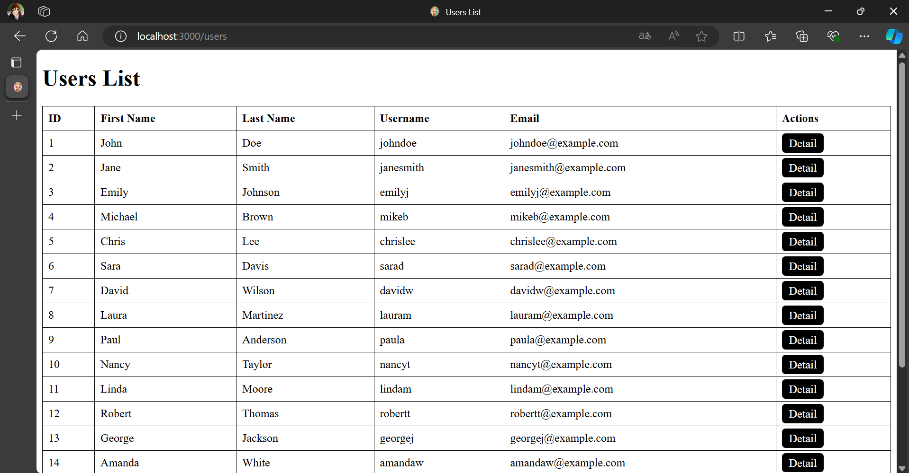
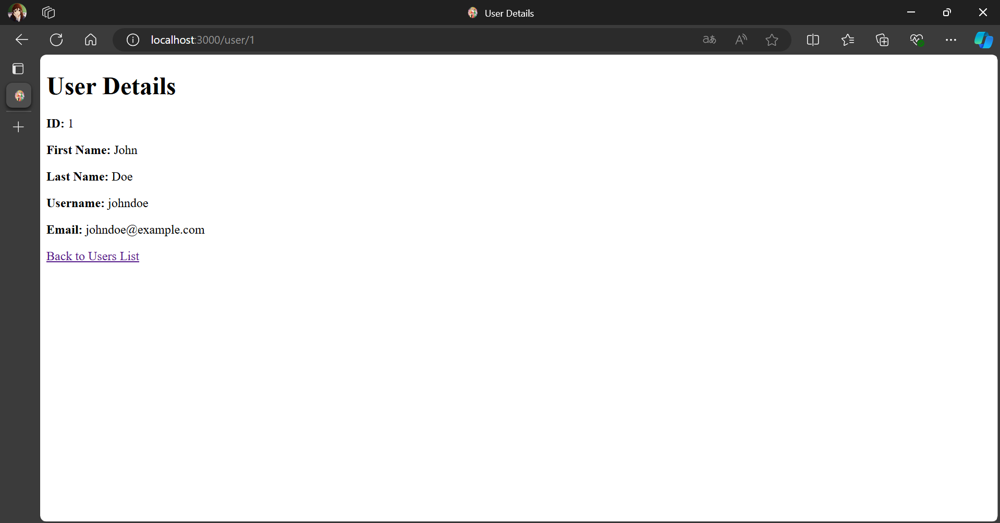

## ให้น้องเขียน Website แสดงข้อมูลต่าง ๆ ดังนี้

** ใช้ข้อมูลจาก [user_data.db](./user_data.db)

`/users` ให้แสดงข้อมูลของ Users ทั้งหมด เป็นตารางที่แสดงข้อมูลของ Users โดยจะแสดง ID, First Name, Last Name, Username, Email และจะมีปุ่ม Detail ที่เมื่อกดไปแล้วจะไปยังหน้า `/user/${user_id}` แล้วแสดงเฉพาะข้อมูลของผู้ใช้คนนั้น พร้อมปุ่มกลับไปยังหน้า `/users`

